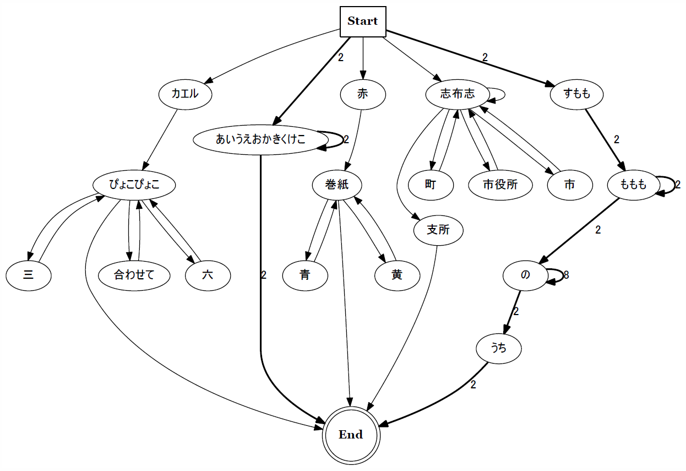

habomaijiro_syntax_diagram
===

## Author
7tuv

## Description
　任意のユーザーのツイートに対して形態素解析を適用し，構文の規則性を可視化するツールです．
当初は@habomaijiro氏のツイートの解析が目的でしたが，任意のツイート，さらには任意の文章に対しても適用可能です．

### できること
* ツイートを取得してテキストとして保存
* 保存したツイート（もしくは任意の文章）を形態素解析により分かち書き ⇒ それらに対しN階マルコフ連鎖を適用してGraphvizにより可視化

### 機能
* Twitterから任意のツイートの取得
* 形態素解析ツールMeCabを用いた文章の品詞分解
* 分解した品詞の群をN階マルコフ連鎖モデルに適用
* Graphvizを用いた構文図の作成
* 構文図の縮約を実行し，縮約後の構文図の作成
	- 縮約は直列方向と並列方向の2種類
		- 並列方向の縮約はまだ不完全
* N階マルコフ連鎖に基づく文章のランダムな生成

## Requirements
* Your Twitter API Key
* Graphviz
* MeCab
* Python3
* Python packages from PyPI
	- requests
	- requests_oauthlib
	- graphviz
	- mecab-python3

## Example
### 準備
　まずTwitter APIを利用するのに必要な情報（Consumer Keyなど）をyou_API_keys.pyに入力してください．
それと各種必要なRequirementsを導入してください．

### ツイートの取得
	$ python get_tweets.py　<ユーザー名> <取得ツイート数>
		# ユーザー名を指定してツイートを取得
		# ツイートはtweets.txtとして保存される

### テキストの解析
	$ python markov_chain.py				# N(=1)階マルコフ連鎖による形態素の可視化をサンプルテキストに適用

	$ python markov_chain.py <N> <テキスト>	# <N>階マルコフ連鎖による形態素の可視化を<テキスト>(.txt)に適用し
											# 画像(.pdf)とdot言語ファイル(.gv)ファイルを出力

ものによっては画像出力に数十分かかります．またグラフのedge数が1000超えると出力が上手くいかなくなることがあります

　以下のような文章群(sample.txt)の適用を例に挙げると，次のような画像が出力されます．

	あいうえおかきくけこ
	
	あいうえおかきくけこあいうえおかきくけこあいうえおかきくけこ
	
	すもももももももものうち
	
	赤巻紙青巻紙黄巻紙
	
	カエルぴょこぴょこ三ぴょこぴょこ合わせてぴょこぴょこ六ぴょこぴょこ
	
	志布志市志布志町志布志志布志市役所志布志支所
	
	すもももももももものののののののののうち

詳しくは`sample/`内の`output<m>_N<n>.pdf`を見てください．`<m>`は，`<m>=0`のとき縮約をしていない図，`<m>=1`のとき直列方向の縮約をした図，`<m>=2`のとき直列と並列方向の縮約をした図となっています．`<n>`はマルコフ連鎖の階数です．

`markov_chain.py`内では，`gen_graphviz(<ファイル名>)`関数によってグラフの出力を，`chain_contraction_serial(<階数>)`と`chain_contraction_parallel(<階数>)`関数によってそれぞれ直列方向と並列方向のグラフの縮約を行っています．

### ランダムな文章生成
　`markov_chain.py`内の`gen_random_sentense(<回数>)`関数によって，マルコフ連鎖お馴染みのランダムな文章生成を任意の回数することができます．

## Detail
　後で書く

## Others
　外部に公開することを想定していなかったので，コードとかreadmeとかめっちゃ適当ですがご了承下さい．

## Licence
MIT License
